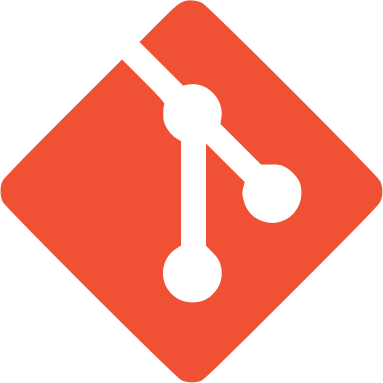

<p align="center">
   

   
</p>

<p align="center">
   <a href="https://www.linkedin.com/in/cauã-v-silva/"></a>
   <a href="mailto:csilvanp@gmail.com"></a>
   <a href="https://instagram.com/cauavsilva"></a>
   <a href="https://www.facebook.com/profile.php?id=100028612230071&viewas=100000686899395"></a>
</p>
<hr/>

<h3 align="center">Favorite techs & tools</h3>
  <table align="center">
  <tr>
    <td align="center" width="96">
      
      <br>HTML
    </td>
    <td align="center" width="96">
      
      <br>CSS
    </td>
    <td align="center" width="96">
      
      <br>Javascript
    </td>
    <td align="center" width="96">
      
      <br>Typescript
    </td>
    <td align="center" width="96">
        
      <br>React
    </td>
    <td align="center" width="96">
        
      <br>Bootstrap
    </td>
    <td align="center" width="96">
        
      <br>Sass
    </td>
    <td align="center" width="96">
        
      <br>Laravel
    </td>
    <td align="center" width="96">
        
      <br>PHP
    </td>
  </tr>
  <tr>
    <td align="center" width="96"> 
        
      <br>Docker
    </td>
    <td align="center" width="96">
        
      <br>ZSH
    </td>
    <td align="center"  width="96">
        
      <br>Windows
    </td>
    <td align="center"  width="96">
        
      <br>Opera GX
    </td>
    <td align="center" width="96">
        
      <br>Git
    </td>
    <td align="center"  width="96">
        
      <br>MySQL
    </td>
    <td align="center" width="96">
        
      <br>Discord
    </td>
    <td align="center" width="96">
        
      <br>VS Code
    </td>
    <td align="center" width="96">
        
      <br>Wordpress
    </td>
  </tr>
</table>
<hr/>

<h3 align="center">Github Stats & Streak</h3>

<p align="center"> 
   
     
</p>
<hr/>
<h3 align="center">My setup</h3>

  ```js
  const setup = {
    hardware: {
      cpu: "AMD Ryzen 5 3400G",
      gpu: "Integrated (Vega 11, 2GB)",
      mobo: "Asus PRIME A320M-K/BR",
      ram: "8GB DDR4 2400 MHz", 
    },
    software: {
      os: "Windows 10",
      browser: "Opera GX",
      code_editor: "VS Code",
      terminal: "zsh",
    }
  }
  ```
  
<hr/>
<h3 align="center">🎵 Listening to: 🎵</h3>
<p align="center">  
   
<p/>


